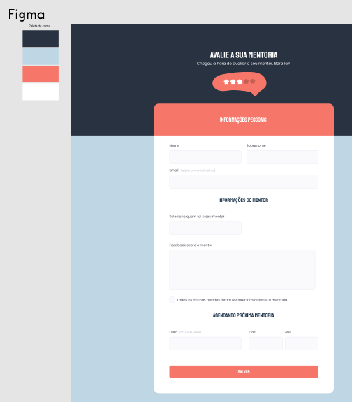

## Creating-Forms-02
<h3 align="center">The objective</h3>

> 

> The idea of creating this form was for further learning, reviewing and applying new concepts
>  
> This form was created from zero based on figma and without consultation
>  
> I also evened out some spacings that were 1 or 2px apart only
>  
> It was also implemented a better accessibility applied on the checkbox to be accessed through the tab (On that part I had to do a little bit of consulting. I didn't know that the previous div had to have the position relative and the input absolute. I had done it as the input being relative and the new one as absolute, the two were close but never in the same square. It was useful for me not to forget anymore)
>  
> and also darkening what didn't have the ideal contrast when you put the mouse over it
> 

<h3>Figma</h3>

 

Figma link:	
 	

 
<b>The form was based on this figma project above</b>
 	

<h3 align="center">Created form!</h3>

<h4>Made by</h4>
    

<h3>Alef Warchon</h3>

